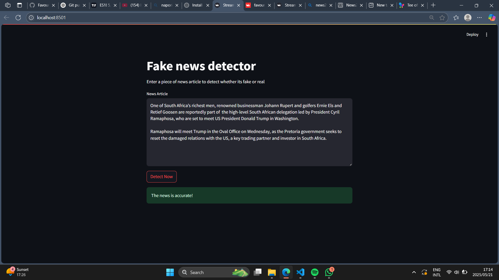

# 📰 News Detection App (Fake News Classifier)

This is a Streamlit-based web application that detects **fake news** to help keep people **informed and not misguided**.

---

## 📌 Description

The app uses a machine learning model trained on a dataset of **fake** and **real news articles** to classify new inputs as either **Real** or **Fake**.

Built with simplicity in mind, this app provides a quick and interactive way to verify news content.

---

## 🛠️ Tech Stack

- **Python**
- **Scikit-learn**
- **Pandas**
- **Streamlit**
- **Joblib**

---

## 🖼️ Screenshot




---

## 🚀 How to Run Locally

1. **Clone this repository**:
   ```bash
   git clone https://github.com/FavourMtshali/Fake_News_detection-app.git
   cd Fake_News_detection
